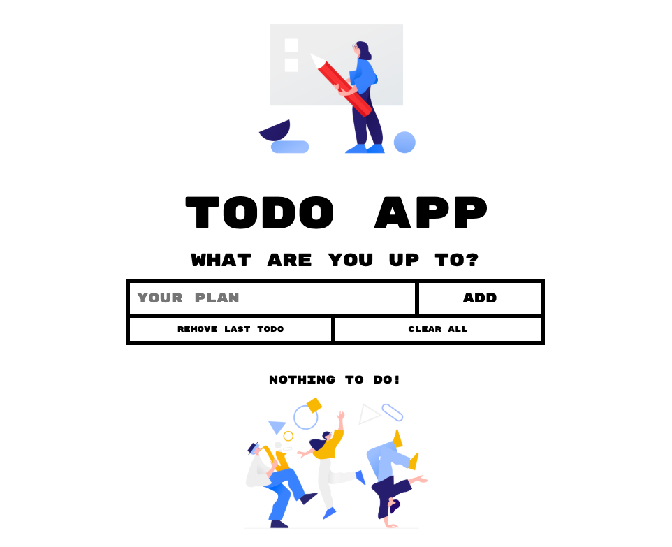

# Angular TODO app
An app which helps you to organize your plans better.

## Table of Contents
- Requirements
- Setup
- General info
- Technologies
- Additional info

### Requirements
- Node 10.9+
- [Angular CLI](https://github.com/angular/angular-cli) 

### Setup
- Install dependencies
    $ npm install
- Run `ng serve` for a dev server. Navigate to `http://localhost:4200/`. 

### General info
Project is a simple app for people who want to write down their plans. It is possible to add, delete last one and remove all of the tasks.

### Technologies
- CSS3 / SASS / BEM
- HTML5
- JavaScript / Angular 7+

### Additional info
The idea to create TODO app was to learn basics of Angular. Images were downloaded from [Icons8](https://icons8.com/ouch).
